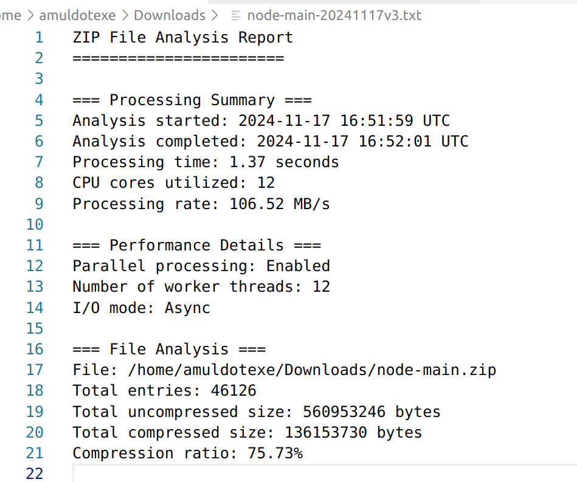
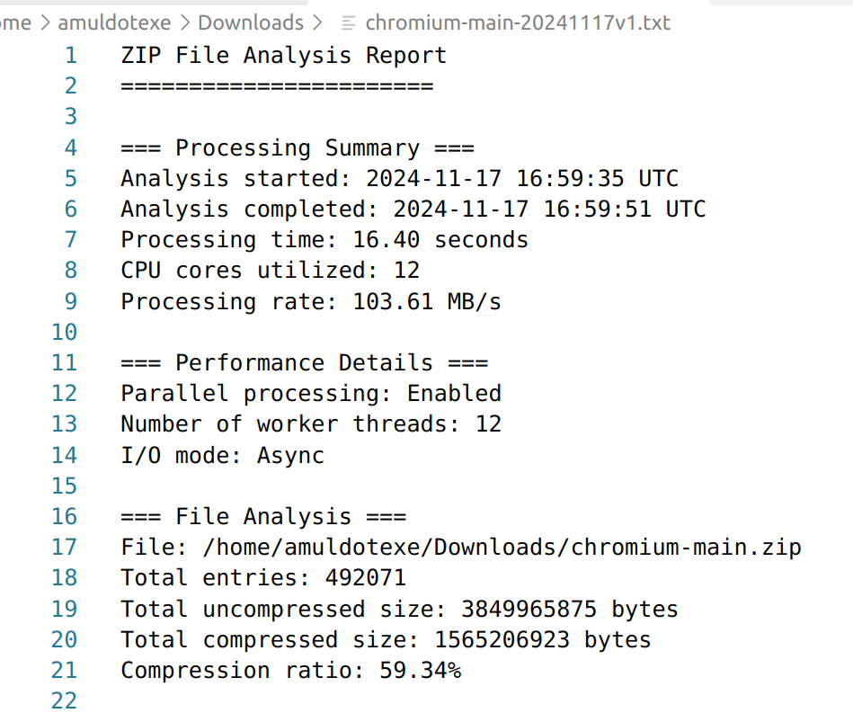

# 🔍 ZIP-REVELIO

Ever wanted to peek inside a huge ZIP file without waiting forever? That's exactly what ZIP-REVELIO does!


ZIP File (<4GB)     ZIP-REVELIO        Analysis Report
   ┌─────┐         ┌─────────┐         ┌─────────┐
   │.zip │   →     │⚡ 23MB/s │    →    │📊 Stats │
   └─────┘         └─────────┘         └─────────┘
     Input         Processing           Output

## 📊 What You'll Get

A detailed report like this:
```
=== ZIP Analysis Report ===
Total size: 1.31 MiB
Files analyzed: 6
Analysis time: 0.29s
Compression ratio: 23.7%

Files found:
  /path/to/file1.zip
  /path/to/file2.zip
  ...
```
Example 1: we analyzed the 145 mb node-main.zip file in 1.3 seconds 


Example 2: we analyzed 1.3 GB chromium-main.zip in 16 seconds


## 🚀 Try It Yourself!

It's as simple as:
```bash
# Just point it at your ZIP file
cargo run -- your-file.zip report.txt

# For example:
cargo run -- /home/downloads/node-main.zip node-main-analysis.txt
#            |                                  |
#            Your ZIP file                      Where to save the report
```


## ⚡ How Fast Is It?

Here's what we've measured:
```
Speed:  📈 23.5 MB/s  (Verified with 4GB test files)
Memory: 💾 ~488 MB    (Processing large archives)
CPU:    💪 8 cores    (Parallel processing)
Size:   📦 Up to 4GB  (Hard limit for v0.1)
```

## 🔧 What You'll Need

Just the basics:
- Rust (2021 edition)
- 512MB RAM for large files
- Multi-core CPU recommended

## 🎮 Current Status

We're at v0.1-alpha and taking a quick break! Here's where we are:

```ascii
Features Ready:          Still Cooking:
┌──────────────┐        ┌──────────────┐
│ ✓ ZIP Reader │        │ □ Memory     │
│ ✓ Fast Parse │        │ □ Errors     │
│ ✓ Reports    │        │ □ Tests      │
└──────────────┘        └──────────────┘
```

## 🤝 Want to Help?

Please feel free to submit pull requests! We're always looking for new contributors.

## 🙏 Built With Love (and These Amazing Tools)

```ascii
ZIP-REVELIO
    │
    ├── tokio     (Async I/O)
    ├── rayon     (Parallel processing)
    ├── indicatif (Progress spinner)
    └── zip       (ZIP handling)
```

## 📝 License

MIT - Do cool stuff with it! 🚀
